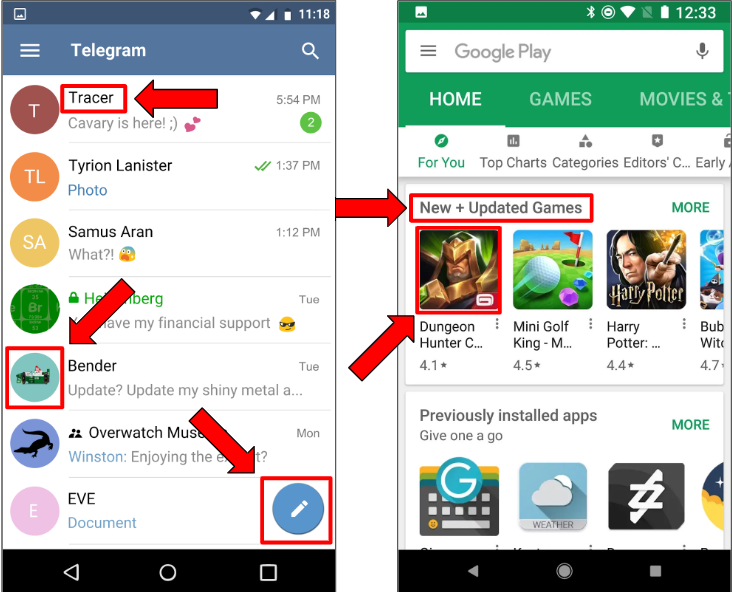

# Introduction to Android Development (HOTH 7)

## Resources

- [**Workshop Slides**](https://tinyurl.com/hoth7-android-slides)

**Kotlin**

- [Documentation](https://kotlinlang.org/docs/reference/)
- [Interactive Tutorial](https://blog.jetbrains.com/blog/2019/12/05/jetbrains-academy-kotlin/)

**Android Studio**

- [Documentation](https://developer.android.com/guide)
- [Activities](https://developer.android.com/guide/components/activities/intro-activities)
- [Layouts](https://developer.android.com/guide/topics/ui/declaring-layout)
- [Views](https://developer.android.com/guide/topics/ui/controls/button)
- [Starting Your First Project](https://developer.android.com/training/basics/firstapp)

## What we will cover in this workshop:

- [Android Studio Installation](#setup-installing-android-studio)
- [Components of Android Studio](#developing-in-android-studio)
  - [Activities](#activities)
  - [Layouts](#layouts)
  - [Views](#views)
- [Demo App: Personality Quiz!](#demo-application-personality-quiz)

## Setup: Installing Android Studio

1. Go to the Android Studio [download page](https://developer.android.com/studio)
2. Click the green "Download Android Studio" button
3. Click the downloaded file to start the install
4. Follow the instructions on your screen, they may vary based on your operating system
5. Click through the installer. The default settings should work. If you're feeling edgy, you can choose the dark theme.
6. After you finish on the last page, the installer will download a lot of components. This may take some time.
   - Things you can do while Android Studio is downloading:
     - Eat lunch at BPlate
     - Go to other HOTH workshops
     - Run the UCLA campus loop
7. If all went well, the menu should show up like this after it's done!


## Setup: Try creating a project

1. From the welcome menu, select "Start a new Android Studio project"
2. On the "Choose your project" window, select **Empty Activity**
3. The next page should ask you for some information for your project. You can name it anything. Make sure the language is **Kotlin** and "use AndroidX artifacts" is checked. You can set the minimum API version to **API 19: Android 4.4 (KitKat)** for our purposes.
4. Finish

## Setup: Try running the project

1. You'll need an emulator! Select **Tools>AVD Manager**. It should show you your virtual devices which will probably be empty.
2. Click **+Create a Virtual Device** and choose a device like the Pixel XL.
3. Next, the **System Image Dialog** should appear. Select an option in the recommended list and click **next**. We'll use **Q**.
   - NOTE: You'll likely have to download it by clicking the **download** link next to it. ⚠️**THIS MAY TAKE A WHILE** ⚠️.
4. Click **finish** on the next window
5. You should be able to run your project with the **green play button** on the top right corner of the screen now!
   - Starting the device the first time may take a minute
   - Also if there is a small message at the bottom of the window that says "Gradle Running" or something similar then just wait for it to finish before doing anything else

## Developing in Android Studio

Before we can start creating our Android mobile app, we must first understand how Android Studio organizes any project. The primary components of any Android project are activities, layouts, and views. We will explain what each of these components are and how they work together to create parts of our application.

## Activities

All Android apps made in Android Studio consist of a set of actitvities so it is essential to understand what activities are and how we create them.

The most general definition of an activity is a **description of user interactions** which are usually associated with some page/screen in our application. Essentially what this means is that an activity implements all the application logic that allows a specific screen to function as desired. Because activities are presented to the user through some visual window on their device, we say that on a high level, **activities represent screens in your app.**

For example, I may want to create a screen in my application that handles the navigation between many other screens. I would then create a NavigationActivity to handle all the logic for this screen, so that each option navigates to the correct screen as desired. This user logic would then be presented on the display to look something like this:


Another example of an activity could be a screen that requests some user's login information. I would represent this Login screen with a corresponding LoginActivity file. The contents of this file would handle parsing of user input and the submission of the login information. This logic is then presented to the user visually like so:


The most important thing to understand about an activity is that it primarily serves as an **implementation of application logic.** The visual display through which an activity is presented is not implemented by the activity itself, this is instead handled by layouts, which we will explain in detail later.

## The Main Activity

Before we get into how to present activities to the user, first I'd like to go over this notion of the **"Main Activity."** If I have activities to represent navigation screens and login screens, the MainActivity represents the startup screen for your application. You can think of the MainActivity as like the **entry point for the app**, it will be the first screen that is displayed to the user whenever they launch your app.

The creation of the MainActivity file is handled for you by the Android Studio IDE whenever you create a new project.

If you are in the **'Project'** view of the project directory, then you can locate the MainActivity file under:\
`app > src > main > java > your.package.name > MainActivity`


If you are in the **'Android'** view of the project directory, then the MainActivity file will be under:\
`app > java > your.package.name > MainActivity`


Now that we have an understanding of the logical components of Android applications, let's get into what we need to create the visual components of our app!

## Layouts

As we've established, activities describe a set of user interactions which are then presented to the user thorugh some visual layout. So what is this notion of a layout and how do we create one?

Layouts dictate the **visual elements associated with a screen**: they specify what components should appear on the screen, where they should be, and what they should look like.

If in the **'Project'** view of directory, layouts can be found under:\
`app > src > main > res > layout`


If in the **'Android'** view of directory, layouts can be found under:\
`app > res > layout`


## Layouts: Text vs Design

There are two ways that you, as a developer, can decide to design and create a given layout. These are known as the **Text** and **Design** views.

In the **Text** view, you will find a textual representation of the elements that will be displayed on the screen. They are formatted in such a way that we have "< tags />" identifying what kind of element is being displayed and then also fields associated with each tag specifying its attributes.


The **Design** view gives you a visual and interactive way to add elements to the layout and specify where they should be placed. Additionally, clicking on any specific element will bring up a sidebar that allows you to change its attributes.


Note: The way you design a layout is up to your own personal preference and will likely involve a mixture of both views.

## Views

Okay awesome, now we know what part of the project is responsible for what shows up on the screen. But how do we design and create the elements that go into a layout?\
The answer is Views.

Views are the **building blocks of any layout**; they are the visual elements that comprise any layout file we create. All elements that appear in a layout and are seen by the user are known as Views.

Here are some examples of basic views:

- TextView: displays some text
- ImageView: contains an image
- Button: creates a button that can be clicked by user



# Demo Application: Personality Quiz!

Now that we understand all the essential components needed to create an Android application, let's work together to build a small interactive application so we can get familiar with the Android Studio IDE.

### Let's start coding!

First of all, we have to start with how our app will look. Ultimately, we want to get it to look something like this:


As you can see, this all starts with the `activity_main` file, which contains the main layout code for our initial activity.

I will demonstrate how to design our app using the design tab. If you have trouble following along, you can always copy and paste the XML code [here](/app/src/main/res/layout/activity_main.xml).

- After copying the XML, you might find references to `@string` resources in the layout XML files. We have to create the string resource yourself.

With all the layout out of the way, we can start implementing the logic behind our app.

In the kotlin file, the main thing that we are concerned with is the `MainActivity` class.
And within the `MainActivity` class, the most important function, is the `OnCreate()` function, which is the function that is first executed when our activity is created.

So now, we are going to use the `findViewByID` method to get a reference to any view that we created in our XML file.
Then, we use the `setOnClickListener` method to give some functionality to our buttons so that once the button is clicked, it will execute whatever function is inside the curly braces `{}`.

```kt
lateinit var leftButton: Button
    lateinit var titleText: TextView
    lateinit var questionText: TextView
    override fun onCreate(savedInstanceState: Bundle?) {
        super.onCreate(savedInstanceState)
        setContentView(R.layout.activity_main)

        val rightButton: Button = findViewById<Button>(R.id.rightButton)
        rightButton.setOnClickListener { rightButtonClicked() }

        leftButton = findViewById<Button>(R.id.leftButton)
        questionText = findViewById(R.id.questionText)
        titleText = findViewById<TextView>(R.id.titleText)

    }
```

For those who are new to kotlin, the `lateinit` keyword is just basically telling android that this variable exists and we will define it later.

Now lets define these functions.

Feel free to copy and paste the code below if you would rather follow along with the workshop.

But before that, we are going to define some member variables for our class.

```kt
var gameStart: Boolean = false
    var questionNum: Int = 0
    var points: Int = 0
    val questions = arrayListOf(
        "If you found a $100 bill on the floor, would you keep it for yourself?",
        "Do you say sorry to people for no reason?",
        "Do you watch anime?",
        "Do you watch Kdrama?",
        "Would you say money is an indicator of success?",
        "Do you like dogs?",
        "Do you like BPlate?"
        )

    lateinit var leftButton: Button
    lateinit var titleText: TextView
    lateinit var questionText: TextView
    override fun onCreate(savedInstanceState: Bundle?) {
        super.onCreate(savedInstanceState)
        setContentView(R.layout.activity_main)

        val rightButton: Button = findViewById<Button>(R.id.rightButton)
        rightButton.setOnClickListener { rightButtonClicked() }

        leftButton = findViewById<Button>(R.id.leftButton)
        questionText = findViewById(R.id.questionText)
        titleText = findViewById<TextView>(R.id.titleText)

    }
```

Now, we can start with our first function.

```kt
private fun rightButtonClicked(){
        if(rightButton.text == "Start"){
            playGame()
        }
        else if(rightButton.text == getString(R.string.playAgain)) {
            questionNum = 0
            points = 0
            playGame()
        }
        else {
            points++
            questionNum++
            playGame()
        }

    }
```

```kt
private fun playGame(){
        if (questionNum == 0 && !gameStart){
            rightButton.text = getString(R.string.yes)
            leftButton.text = getString(R.string.no)
            gameStart = true
        }
        else if (questionNum == 7){
            println("I was here")
            gameStart = false
            showResults()
            return
        }

        val qNumber = questionNum + 1
        titleText.text = "Question $qNumber"
        questionText.text = questions[questionNum]

        rightButton.setOnClickListener { rightButtonClicked() }
        leftButton.setOnClickListener { leftButtonClicked() }

    }
```

```kt
private fun showResults(){
        val personality: String = when(points) {
            -7 -> {"Scum"}
            -6 -> {"Evil"}
            -5 -> {"Small-minded"}
            -4 -> {"Greedy"}
            -3 -> {"Need Help"}
            -2 -> {"Idiot"}
            -1 -> {"Slightly degenerate"}
            0 -> {"Acceptable"}
            1 -> {"Unremarkable"}
            2 -> {"A Weeb"}
            3 -> {"Slightly useful to society"}
            4 -> {"Has a chance to succeed in life"}
            5 -> {"Koreaboo"}
            6 -> {"Either you are faking it or you are a samaritan"}
            7 -> {"Stop lying you showoff, go home"}
            else-> {"You have been deemed unjudgeable by the Sibyl System"}
        }

        titleText.text = getString(R.string.resultsTitle)
        questionText.text = personality

        leftButton.text = getString(R.string.quit)
        rightButton.text = getString(R.string.playAgain)

        rightButton.setOnClickListener { rightButtonClicked() }
        leftButton.setOnClickListener { leftButtonClicked() }
    }
```
